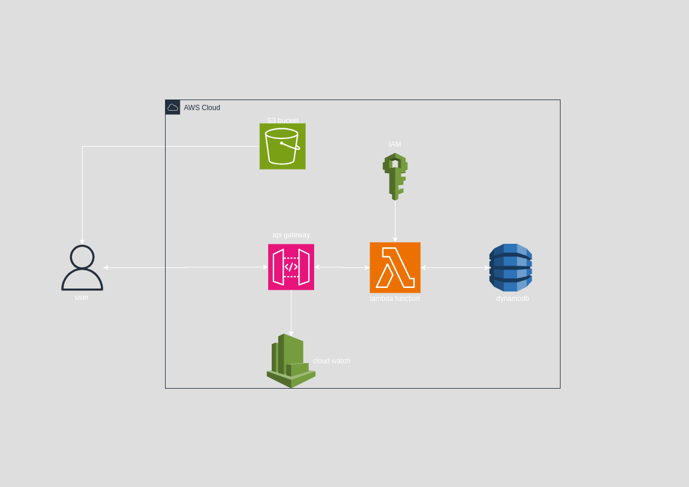

# Serverless REST API with DynamoDB and API Gateway

This project is part of Manara Tech's **AWS 2: Becoming a Solutions Architect** program. It demonstrates how to design and deploy a fully serverless REST API using AWS services including API Gateway, AWS Lambda, DynamoDB, S3, IAM, and CloudWatch.

---

## Architecture Diagram

---

## Architecture Overview

- The frontend (HTML/JS) is hosted on **Amazon S3** as a static website.
- Four **AWS Lambda** functions are used to handle Create, Read, Update, and Delete (CRUD) operations.
- **Amazon API Gateway** exposes four corresponding REST endpoints.
- Lambda functions have appropriate **IAM roles** granting access to **Amazon DynamoDB**.
- A **DynamoDB** table stores the to-do list or customer records.
- **CloudWatch** is used for logging and monitoring Lambda executions and API activity.

---

## System Flow

1. The user accesses the frontend hosted on **S3**.
2. The frontend sends HTTP requests to **API Gateway**.
3. **API Gateway** routes the request to the appropriate **Lambda function**.
4. The Lambda function performs the necessary operation on the **DynamoDB table**.
5. The result is returned back to the frontend.

---

## Key AWS Services Used

- **Amazon API Gateway**: Exposes and manages REST API endpoints.
- **AWS Lambda**: Serverless compute that runs stateless functions triggered by HTTP requests.
- **Amazon DynamoDB**: A managed NoSQL database for scalable, low-latency data storage.
- **AWS IAM**: Manages permissions for Lambda functions to access DynamoDB.
- **Amazon CloudWatch**: Provides logs and metrics for observability.
- **Amazon S3**: Hosts the static frontend assets (HTML, CSS, JS).

---

## Learning Outcomes

- Designing scalable, event-driven serverless applications.
- Implementing API Gateway with Lambda for stateless API execution.
- Using DynamoDB with access control and best practices.
- Securing APIs using IAM roles and resource policies.
- Hosting a static frontend on S3 with integrated serverless backend.

